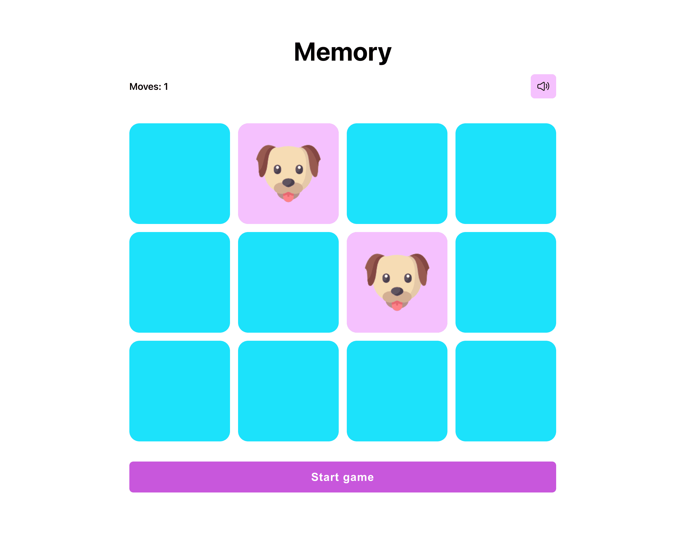

# Memory Game

## Ejemplo en vivo

- [Ver página](https://memory-game-68f1.onrender.com/)

## Descripción 📑

El proyecto consiste en un juego de cartas tipo memory implementado utilizando HTML, CSS y TypeScript. El objetivo del juego es encontrar todas las parejas de cartas iguales en el menor número de intentos posible.

El juego cuenta con una interfaz gráfica atractiva y fácil de usar. Las cartas se distribuyen aleatoriamente en una cuadrícula y el jugador puede seleccionar dos cartas en cada turno. Si las cartas seleccionadas son iguales, se mantienen visibles en la cuadrícula. Si no son iguales, se vuelven a ocultar y el jugador debe recordar su ubicación para futuros intentos.

El proyecto utiliza HTML para estructurar el contenido de la página, CSS para estilizar las cartas y la interfaz gráfica, y TypeScript para agregar funcionalidad y lógica al juego. Se han aplicado conceptos de programación orientada a objetos y manipulación del DOM para crear una experiencia interactiva y entretenida.

## ¿Qué he aprendido en este proyecto? 🙇🏻

Durante el desarrollo de este proyecto, he adquirido y reforzado varios conocimientos y habilidades relacionadas con el desarrollo web. Algunos de los aspectos destacados que he aprendido incluyen:

1. Uso de HTML y CSS: He mejorado mis habilidades en la creación de estructuras HTML semánticas y en la aplicación de estilos CSS para diseñar una interfaz atractiva y receptiva.

2. Programación en TypeScript: He utilizado TypeScript para escribir código más limpio y mantener una base de código más sólida. A través de TypeScript, he aprovechado características como el tipado estático y las interfaces para hacer que mi código sea más robusto y fácil de mantener.

3. Manipulación del DOM: He adquirido experiencia en la manipulación del Document Object Model (DOM) utilizando TypeScript. He utilizado métodos y propiedades del DOM para crear y modificar elementos en tiempo real, permitiendo una interacción fluida con el usuario.

4. Lógica de juego: El desarrollo de este proyecto me ha desafiado a diseñar y implementar la lógica del juego de cartas. He aprendido a gestionar la lógica de las cartas seleccionadas, la verificación de las parejas y el control de los intentos del jugador.

5. Optimización y rendimiento: He adquirido conocimientos sobre cómo optimizar el rendimiento del juego, minimizando la cantidad de operaciones innecesarias y mejorando la eficiencia del código.

En general, este proyecto me ha permitido aplicar y expandir mis habilidades como desarrolladora web, así como enfrentar desafíos y aprender nuevas técnicas en el proceso. Estoy satisfecha con el resultado final y estoy emocionada por seguir desarrollando proyectos web en el futuro.

## Tecnologías 🛠

<!-- Iconos sacados de: https://github.com/hendrasob/badges/blob/master/README.md y https://github.com/alexandresanlim/Badges4-README.md-Profile -->

>)

## Autora ✒️

**Leticia de la Osa**

- [contacto@deletidev.com](mailto:contacto@deletidev.com)
- [LinkedIn](https://www.linkedin.com/in/deletidev)
- [Mi porfolio web](https://deletidev.com/)

## Instalación ⚙️

- Clonate el proyecto.
- Instala las dependencias con `npm install`.
- Ejecuta el sandbox con `npm run dev` o primero `npm run build` seguido de `npm run preview`.
- Abre el navegador en `http://localhost:4173/` (si ese puerto no te funciona, mira en la consola donde has hecho el build, puede que este ocupado y se haya abierto en otro puerto).

## Licencia 📄

MIT Public License v3.0
No puede usarse comercialmente.
